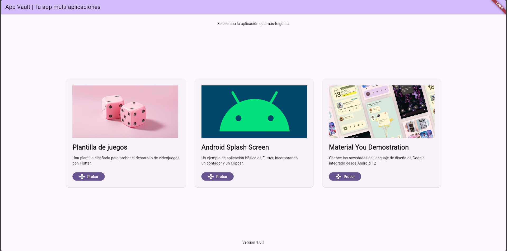

# App Vault

Una aplicación que unifica varias aplicaciones de Flutter en un solo lugar!. Navega entre tres proyectos innovadores de la mano de este potente SDK desarrollado por Google.

## Desarrolladores
- Delgado Yela Bryan Paul
- Miño Ochoa Mateo Rafael

## Indicaciones
Para disfrutar del proyecto, debes realizar los siguientes pasos:
1. Clona el proyecto con el comando <code>git clone <ruta_repositorio></code>
2. Dirigete a la carpeta del proyecto con el comando <code>cd [ruta_proyecto]</code>
3. Instala las dependencias con el comando <code>flutter pub get</code>
4. Inicializa el programa con el comando <code>flutter run</code>

## Capturas de funcionamiento
